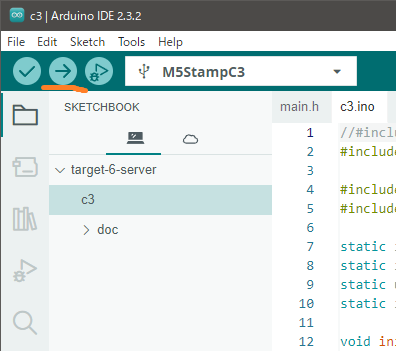

# Build and Upload

Download a source code archive or clone source code repoistory from GitHub.
Please refer:

```
https://github.com/katsuster/target-6-server
```

Select [File] - [Open] and open the `target-6-server/c3/c3.ino` file.


## Use Automatic Bootloader

There is no special settings for M5Stamp C3 GPIO pins.
Just press Upload button.



The IDE shows such log messages in output window if upload is successful.

```
Sketch uses 980888 bytes (74%) of program storage space. Maximum is 1310720 bytes.
Global variables use 38508 bytes (11%) of dynamic memory, leaving 289172 bytes for local variables. Maximum is 327680 bytes.
esptool.py v4.5.1
Serial port COM9
Connecting....
Chip is ESP32-C3 (revision v0.4)
Features: WiFi, BLE
Crystal is 40MHz
MAC: 60:55:f9:96:04:c4
Uploading stub...
Running stub...
Stub running...
Changing baud rate to 921600
Changed.
Configuring flash size...
Flash will be erased from 0x00000000 to 0x00003fff...
Flash will be erased from 0x00008000 to 0x00008fff...
Flash will be erased from 0x0000e000 to 0x0000ffff...
Flash will be erased from 0x00010000 to 0x00106fff...
Compressed 13200 bytes to 9522...
Writing at 0x00000000... (100 %)
Wrote 13200 bytes (9522 compressed) at 0x00000000 in 0.4 seconds (effective 286.1 kbit/s)...
Hash of data verified.
Compressed 3072 bytes to 146...
Writing at 0x00008000... (100 %)
Wrote 3072 bytes (146 compressed) at 0x00008000 in 0.1 seconds (effective 382.9 kbit/s)...
Hash of data verified.
Compressed 8192 bytes to 47...
Writing at 0x0000e000... (100 %)
Wrote 8192 bytes (47 compressed) at 0x0000e000 in 0.1 seconds (effective 516.3 kbit/s)...
Hash of data verified.
Compressed 1010800 bytes to 552572...
Writing at 0x00010000... (2 %)
Writing at 0x0001b36d... (5 %)
...snip...
Writing at 0x000f647d... (94 %)
Writing at 0x000fbf3c... (97 %)
Writing at 0x0010217a... (100 %)
Wrote 1010800 bytes (552572 compressed) at 0x00010000 in 15.7 seconds (effective 514.7 kbit/s)...
Hash of data verified.

Leaving...
Hard resetting via RTS pin...
```


## Use Manual Bootloader

Sometimes automatic bootloader does not work correctly by using USB hub or other reasons.
The IDE shows such error message about giving up to connect to device.

```
Sketch uses 1003156 bytes (76%) of program storage space. Maximum is 1310720 bytes.
Global variables use 38676 bytes (11%) of dynamic memory, leaving 289004 bytes for local variables. Maximum is 327680 bytes.
esptool.py v4.5.1
Serial port COM3
Connecting......................................

A fatal error occurred: Failed to connect to ESP32-C3: Wrong boot mode detected (0xc)! The chip needs to be in download mode.
For troubleshooting steps visit: https://docs.espressif.com/projects/esptool/en/latest/troubleshooting.html
Failed uploading: uploading error: exit status 2
```

In such case you can use manual bootloader mode.

* Connect GPIO9 and GND by jump wire.
* Press reset button of M5Stamp C3.
* Remove jump wire from GPIO9.

The IDE shows such message if manual bootloader mode is enabled successfully.

```
ESP-ROM:esp32c3-api1-20210207
Build:Feb  7 2021
rst:0x1 (POWERON),boot:0x4 (DOWNLOAD(USB/UART0/1))
waiting for download
```

Press upload button of Arduino IDE.


