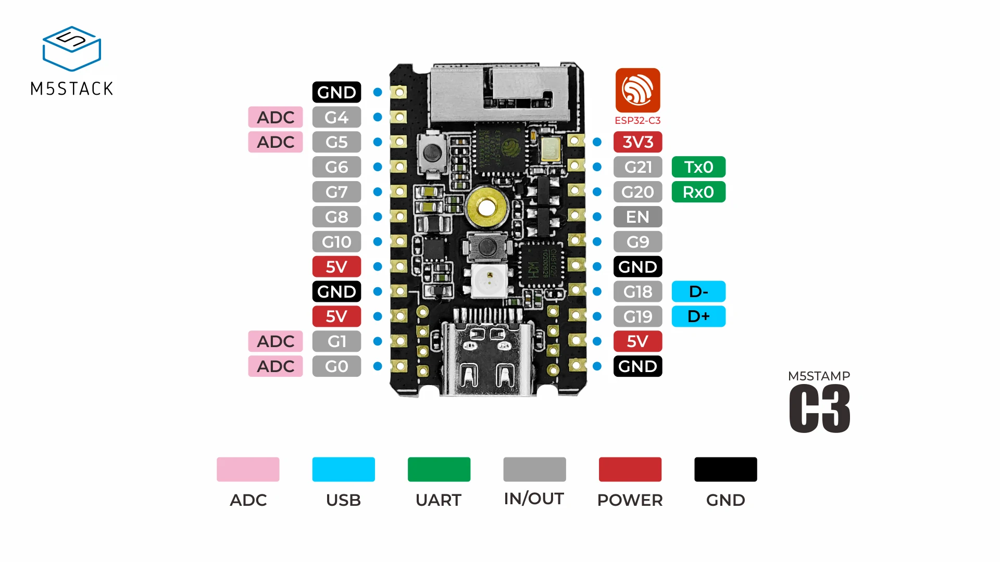

# GPIO

This document describes GPIO and their purpose.

## M5Stamp C3

Please refer M5STACK official documents to refer the original and newest version of image.

URL: https://docs.m5stack.com/en/core/stamp_c3

GPIO purpose and pullup/pulldown status of M5Stamp C3.

| GPIO | Purpose | INPUT PULLDOWN [V] | INPUT PULLUP [V] | INPUT (Hi-Z) [V] | OUTPUT LOW [V] | OUTPUT HIGH [V] |
|--|--|--|--|--|--|--|
| G0  | SENSOR0     | 0    | 3.52 |      | 0    | 3.52 |
| G1  | SENSOR1     | 0    | 3.52 |      | 0    | 3.52 |
| G4  | SENSOR2     | 0    | 3.52 |      | 0    | 3.52 |
| G5  | SENSOR3     | 0    | 3.52 |      | 0    | 3.52 |
| G6  | SENSOR4     | 0    | 3.52 |      | 0    | 3.52 |
| G7  | SENSOR5     | 0    | 3.52 |      | 0    | 3.52 |
| G8  | TARGET_LED0 | 2.72 | 3.52 | 3.6  | 0    | 3.52 |
| G9  | TARGET_LED1 | 3.36 | 3.52 | 3.52 | 0    | 3.52 |
| G10 | TARGET_LED2 | 0    | 3.52 |      | 0    | 3.52 |
| G18 | TARGET_LED3 | 0    | 3.52 |      | 0    | 3.52 |
| G19 | TARGET_LED4 | 0    | 3.52 |      | 0    | 3.52 |
| G20 | ---         | 3.52 | 3.52 | 3.52 | 2.16 | 3.52 |
| G21 | TARGET_LED5 | 0.72 | 3.52 | 3.52 | 0    | 3.44 |

Legends:

* INPUT PULLDOWN: `pinMode(n, INPUT_PULLDOWN);`
* INPUT PULLUP:   `pinMode(n, INPUT_PULLUP);`
* INPUT Hi-Z:     `pinMode(n, INPUT);`
* OUTPUT LOW:     `pinMode(n, OUTPUT); digitalWrite(n, LOW);`
* OUTPUT HIGH:    `pinMode(n, OUTPUT); digitalWrite(n, HIGH);`

