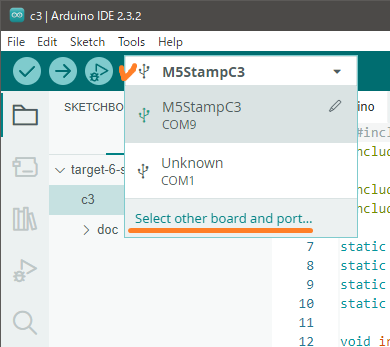

# Setup Arduino IDE

This document describes how to setup Arduino IDE and M5Stack series development environment.
This is short summary of official information is in M5Stack site.

Please refer and check newest detailed information from:

```
https://docs.m5stack.com/en/arduino/arduino_ide
```


## Install Board Management

Select [File] - [Preferences...] menu and add additional boards manager URLs:

```
https://static-cdn.m5stack.com/resource/arduino/package_m5stack_index.json
```


Select Board Manager of sidebar, search for `m5stack`, and click Install.


To check official information, please refer:

```
https://docs.m5stack.com/en/arduino/arduino_board
```


## Install Arduino Library

Select Library Manager of sidebar, search for `m5core2`, and click Install.


To check official information, please refer:

```
https://docs.m5stack.com/en/arduino/arduino_library
```


## Setup the boards

Connect M5StampC3 board to PC and select `M5StampC3` from the combo box list.



* Search for `m5stampc3` and select M5StampC3 from the list of left side.
* Select correct COMn device from right side list.


